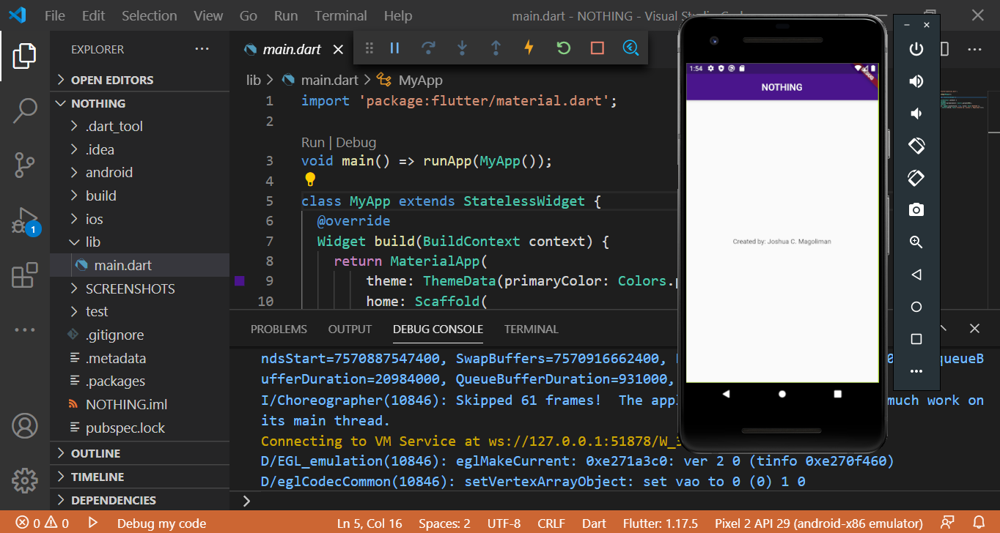

# NOTHING IN FLUTTER

* Purpose: My Project
* Programming Language: Dart
* UI Software Development Kit: Flutter
* Code or Text Editor used: Visual Studio Code
* Type of Application: Mobile Application (Native Application)

<h2> User Interface Screenshot in Desktop Computer</h2> 
  
  
<h2> User Interface Screenshot in Mobile Phone</h2>  
  
  
